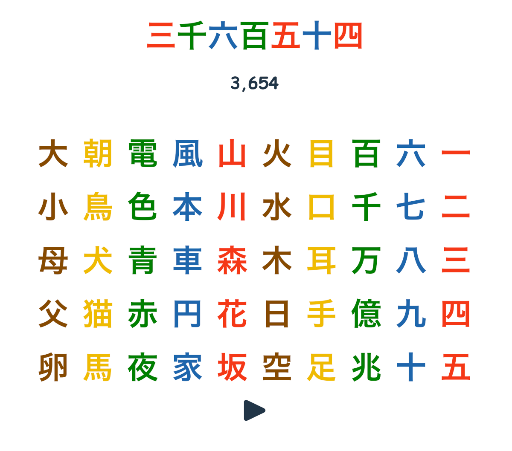

# Langpad



A tablet-focused soundboard app for learning basic kanji (Japanese).

https://langpad.dansakamoto.com

## Background

Langpad was inspired by [Japanese KANJI Touch&Sounds by Jin Hori](https://apps.apple.com/us/app/japanese-kanji-touch-sounds/id1075683691). I would normally avoid ripping off another app's design so exactly, but in this instance I was building for a child was already familiar with that app. The goal was therefore to keep the experience as familiar as possible while making adjustments to cater to their specific interests.

In order to support any number combination (in theory) while keeping the spoken versions as natural-sounding as possible, the app uses [google-tts-api](https://www.npmjs.com/package/google-tts-api) to dynamically generate TTS files. Sound files are cached to limit how many calls are necessary, and the cache is cleared on redeployment.

## Usage

Langpad is set up to work as a progressive web app; if you save it to your tablet's home screen (iOS or Android compatible) and open it from there, it will launch in full-screen mode without the URL bar. This makes it possible to restrict a child to the app without giving them full browser access.

## Dev Requirements

Node.js

## Dev Quickstart

```
npm i
npm run dev
```

Load localhost:3000 from your web browser.
